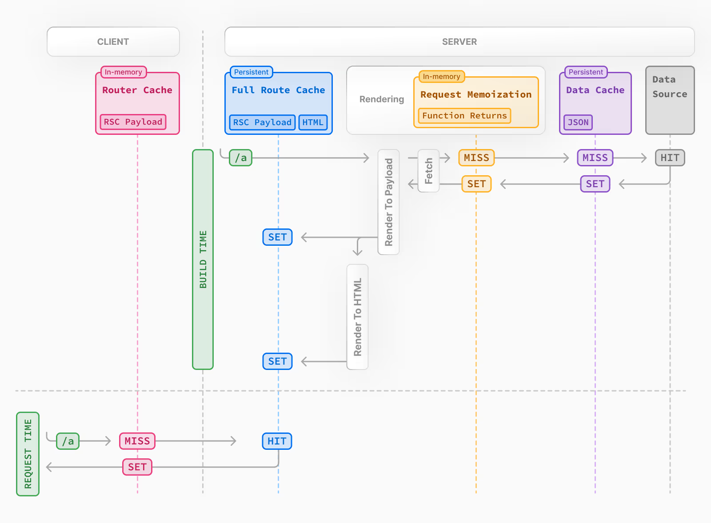

# 缓存

Next.js 通过缓存渲染工作和数据请求来提高应用程序的性能并降低成本。本页面深入介绍了 Next.js 缓存机制、可用于配置它们的 API 以及它们如何相互交互。

!!! note "补充"

    值得一提的是，此页面可帮助我们了解 Next.js 底层的工作原理，但并不是高效使用 Next.js 的必要知识。大多数 Next.js 的缓存触发是由我们使用 API 方法决定，并且具有默认值，可通过最少的配置获得最佳性能。

## 1. 概述

以下是不同缓存机制及其用途的高级概述：

| 机制 | 功能 | 作用端 | 目的               | 生命周期       |
| --- | --- |-----|------------------|------------|
| 请求缓存 | 返回函数值 | 服务端 | 复用 React 组件树中的数据 | 每个请求的生命周期  |
| 数据缓存 | 数据 | 服务端 | 跨用户请求和部署的缓存数据    | 持久（可以重新验证） |
| 全路由缓存 | HTML 和 RSC 有效负载 | 服务端 | 降低渲染成本并提高性能      | 持久（可以重新验证） |
| 路由缓存 | RSC 有效负载 | 客户端 | 减少导航时的服务端请求      | 用户会话或基于时间  |

默认情况下，Next.js 会尽可能多地缓存以提高性能并降低成本，这意味着除非我们选择退出，否则路由将被静态呈现并且数据请求将被缓存。下图显示了默认的缓存行为：在构建时静态渲染路由时以及首次访问静态路由时。



缓存行为会具体取决于路线是静态还是动态呈现、数据是缓存还是未缓存，以及请求是初始访问还是后续导航的一部分而发生变化。根据您的使用案例，我们可以为各个路由和数据请求配置缓存行为。

## 2. 请求记忆

React 扩展了 `fetch` API 以自动记住具有相同 URL 和选项的请求，这意味着我们可以在 React 组件树中的多个位置调用相同数据的获取函数，而只需执行一次。


例如，如果我们需要跨路由（例如在布局、页面和多个组件中）使用相同的数据，则不必在树的顶部获取数据，并在组件之间转发 props。相反，我们可以在需要的组件中获取数据，而不必担心通过网络对同一数据发出多个请求对性能的影响。

```jsx linenums="1" title="app/example.tsx"
async function getItem() {
  // The `fetch` function is automatically memoized and the result is cached
  const res = await fetch('https://.../item/1')
  return res.json()
}
 
// This function is called twice, but only executed the first time
const item = await getItem() // cache MISS
 
// The second call could be anywhere in your route
const item = await getItem() // cache HIT
```

???+ info "请求记忆的工作机制"

    
    
    - 在渲染路由时，第一次调用特定请求时，其结果不会在内存中，而是缓存 `MISS`。
    - 因此该函数将被执行，并且将从外部源获取数据，并将结果存储在内存中。
    - 同一渲染通道中请求的后续函数调用将是缓存命中，数据将从内存中返回，而不执行该函数。
    - 一旦路由被渲染并且渲染过程完成，内存就会被“重置”，并且所有请求记录都会被清除。

    !!! note "补充"
    
        - 请求记忆是一项 React 功能，而不是 Next.js 功能。包含在这里是为了展示它如何与其他缓存机制交互。
        - 请求记忆仅适用于获取请求中的 `GET` 方法。
        - 请求记忆只作用域 React 组件树中，这意味着：
          - 它适用于 `generateMetadata`、`generateStaticParams`、布局、页面和其他服务器组件中的 `fetch` 请求。
          - 它不适用于路由处理程序中的 `fetch` 请求，因为它们不是 React 组件树的一部分。
        - 对于不适合 `fetch` 的情况（例如某些数据库客户端、CMS 客户端或 GraphQL 客户端），我们可以使用 React 缓存功能来记忆函数。


### 2.1 周期

缓存会持续到服务器请求的生命周期，直到 React 组件树完成渲染。

### 2.2 重新验证

由于记忆不会在服务器请求之间共享，并且仅在渲染期间应用，因此无需重新验证它。

### 2.3 选择退出

记忆仅适用于获取请求中的 `GET` 方法，其他方法（例如 `POST` 和 `DELETE`）不会被记忆，此默认行为是 React 优化，我们不建议选择退出。

要管理单个请求，您可以使用 [`AbortController`](https://developer.mozilla.org/en-US/docs/Web/API/AbortController) 中的 [`signal`](https://developer.mozilla.org/en-US/docs/Web/API/AbortController/signal) 属性。然而，这不会选择不记忆请求，而是中止正在进行的请求。

```jsx linenums="1" title="app/example.js"
const { signal } = new AbortController()
fetch(url, { signal })
```

## 3. 数据缓存

Next.js 有一个内置的数据缓存，可以在传入的服务器请求和部署中保留数据获取的结果。这是可能的，因为 Next.js 扩展了原生 `fetch` API，允许服务器上的每个请求设置自己的持久缓存语义。

!!! note "补充"

    值得注意的是，在浏览器中 `fetch` 的 `cache` 选项指示请求如何与浏览器的 HTTP 缓存交互，在 Next.js 中，`cache` 选项指示服务器端请求如何与服务器的数据缓存交互。

我们可以使用 `fetch` 的 [`cache`](https://nextjs.org/docs/app/building-your-application/caching#fetch-optionscache) 和 [`next.revalidate`](https://nextjs.org/docs/app/building-your-application/caching#fetch-optionsnextrevalidate) 选项来配置缓存行为。

???+ info "数据缓存的工作原理"

    

    - 渲染期间第一次调用带有 `force-cache` 选项的提取请求时，Next.js 会检查数据缓存中是否有缓存的响应。
    - 如果找到匹配的缓存响应，则会立即返回并保存。
    - 如果未找到匹配的缓存响应，则会向数据源发出请求，将结果存储在数据缓存中并进行记忆。
    - 对于未缓存的数据（例如，未定义缓存选项或使用 `{cache: 'no-store'}`），始终从数据源获取结果并进行记忆。
    - 无论数据是缓存还是未缓存，请求始终会被记忆，以避免在 React 渲染过程中对相同数据发出重复请求。

    !!! note "数据缓存与请求记忆的区别"
    
        虽然这两种缓存机制都有助于通过重用缓存数据来提高性能，但数据缓存在传入请求和部署中是持久的，而记忆仅持续请求的生命周期。

### 3.1 周期

除非您重新验证或选择退出，否则数据缓存在传入请求和部署中保持不变。

### 3.2 重新验证

由于记忆不会在服务器请求之间共享，并且仅在渲染期间应用，因此无需重新验证它。

- **基于时间的重新验证**：经过一定时间并发出新请求后重新验证数据，这对于不经常更改且即时性不那么重要的数据很有用。
- **按需重新验证**：根据事件（例如表单提交）重新验证数据。按需重新验证可以使用基于标签或基于路径的方法立即重新验证数据组，当您想要确保尽快显示最新数据时（例如，当更新无头 CMS 的内容时），这非常有用。

#### 1. 基于时间的重新验证

要定期重新验证数据，可以使用 `fetch` 的 `next.revalidate` 选项来设置资源的缓存生命周期（以秒为单位）。

```jsx linenums="1"
// Revalidate at most every hour
fetch('https://...', { next: { revalidate: 3600 } })
```

或者，我们可以使用路由段配置选项来配置段中的所有 `fetch` 请求，或者在我们无法使用 `fetch` 的情况下配置。

???+ info "基于时间的数据验证的工作原理"

    
  
    - 第一次调用带有 `revalidate` 的获取请求时，将从外部数据源获取数据并将其存储在数据缓存中。
    - 在指定时间范围（例如 60 秒）内调用的任何请求都将返回缓存的数据。
    - 在该时间范围之后，下一个请求仍将返回缓存的（现已过时）数据。
      - Next.js 将在后台触发数据的重新验证。
      - 成功获取数据后，Next.js 将使用新数据更新数据缓存。
      - 如果后台重新验证失败，之前的数据将保持不变。
  
  这类似于 [stale-while-revalidate](https://web.dev/stale-while-revalidate) 行为。

#### 2. 按需重新验证

数据可以根据路径 ([revalidatePath](https://nextjs.org/docs/app/building-your-application/caching#revalidatepath)) 或缓存标记 ([revalidateTag](https://nextjs.org/docs/app/building-your-application/caching#fetch-optionsnexttags-and-revalidatetag)) 按需重新验证。


???+ info "按需数据验证的工作原理"

    

  - 第一次调用获取请求时，将从外部数据源获取数据并将其存储在数据缓存中。
  - 当触发按需重新验证时，将从缓存中清除相应的缓存记录。
    - 这与基于时间的重新验证不同，基于时间的重新验证将陈旧数据保留在缓存中，直到获取新数据。
  - 下次请求时，又是一次缓存 `MISS`，从外部数据源取数据，存入缓存数据中。

### 3.3 选择退出

如果您不想缓存 `fetch` 的响应，可以执行以下操作：

```jsx
let data = await fetch('https://api.vercel.app/blog', { cache: 'no-store' })
```

## 4. 全路由缓存

!!! note "相关术语"

    我们可能会看到术语“自动静态优化”、“静态站点生成”或“静态渲染”可互换使用，指的是应用程序在构建时的渲染和缓存路由的过程。

Next.js 在构建时自动渲染和缓存路由，这是一项优化，允许我们为每个请求提供缓存的路由，而不是在服务器上渲染，从而加快页面加载速度。

要了解完整路由缓存的工作原理，了解 React 如何处理渲染以及 Next.js 如何缓存结果会很有帮助。

### 4.1 服务端的 React 渲染

在服务器上，Next.js 使用 React 的 API 来编排渲染。渲染工作被分成多个块：按单独的路由段和延迟边界。每个块都分两步渲染：

1. React 将服务器组件呈现为一种特殊的数据格式，针对流进行了优化，称为“React 服务端组件有效负载”。
2. Next.js 使用 React 服务端组件有效负载和客户端组件 JavaScript 指令在服务端上呈现 **HTML**。

这意味着我们不必等待所有内容都渲染完毕才能缓存工作或发送响应。相反，我们可以在工作完成时流式传输响应。

???+ info "什么是 React 服务器组件有效负载？"

    React 服务端组件有效负载是渲染的 React 服务端组件树的紧凑二进制表示。客户端上的 React 使用它来更新浏览器的 DOM。 React 服务器组件有效负载包含：
    
    - 服务端组件的渲染结果
    - 客户端组件应呈现的位置的占位符以及对其 JavaScript 文件的引用
    - 从服务器组件传递到客户端组件的任何道具
    
    要了解更多信息，请参阅服务器组件文档。

### 4.2 服务端的 Next.js 缓存（全路由缓存）

Next.js 的默认行为是在服务器上缓存路由的渲染结果（React 服务端组件负载和 HTML），这适用于构建时或重新验证期间静态渲染的路由。

### 4.3 客户端的 React 注水和协调

在请求时，在客户端上：

1. HTML 用于立即显示客户端和服务器组件的快速非交互式初始预览。
2. React 服务端组件有效负载用于协调客户端和渲染的服务端组件树，并更新 DOM。
3. JavaScript 指令用于补充客户端组件并使应用程序具有交互性。

### 4.4 客户端的 Next.js 缓存（路由缓存）

React 服务端组件有效负载存储在客户端路由器缓存中（一个单独的内存缓存，由各个路由段分割），该路由器缓存用于通过存储以前访问过的路由并预取未来的路线来改善导航体验。

### 4.5 后续导航

在后续导航或预取期间，Next.js 将检查 React 服务端组件有效负载是否存储在路由器缓存中。如果是这样，它将跳过向服务端发送新请求。

如果路由段不在缓存中，Next.js 将从服务器获取 React 服务端组件有效负载，并填充客户端上的路由器缓存。

### 4.6 静态和动态渲染

路由在构建时是否被缓存取决于它是静态渲染还是动态渲染。默认情况下会缓存静态路由，而动态路由会在请求时呈现，并且不会被缓存。下图显示了静态和动态渲染的路由之间的差异，以及缓存和未缓存的数据：


### 4.7 期间

默认情况下，完整路由缓存是持久的。这意味着渲染输出会跨用户请求进行缓存。

### 4.8 失效

有两种方法可以使完整路由缓存失效：

- 重新验证数据:
- 重新部署：与跨部署持续存在的数据缓存不同，完整路由缓存在新部署中会被清除。

### 4.9 选择退出

我们可以选择退出完整路由缓存，或者换句话说，为每个传入请求动态渲染组件，方法是：

- **使用动态API**：这将从完整路由缓存中选择路由并在请求时动态呈现它。数据缓存仍然可以使用。
- **使用 `dynamic='force-dynamic'` 或 `revalidate=0` 路由段配置选项**：这将跳过完整路由缓存和数据缓存，意味着将在每次传入服务器的请求时呈现组件并获取数据。路由器缓存仍然适用，因为它是客户端缓存。
- **选择退出数据缓存**：如果路由有未缓存的 `fetch` 请求，则会选择该路由退出完整路由缓存。将为每个传入请求获取特定获取请求的数据。其他未选择退出缓存的 `fetch` 请求仍将缓存在数据缓存中。这允许缓存和未缓存数据的混合。

## 5. 客户端路由缓存

Next.js 有一个内存客户端路由器缓存，用于存储路由段的 RSC 有效负载，按布局、加载状态和页面划分。

当用户在路由之间导航时，Next.js 会缓存访问过的路线段并预取用户可能导航到的路线。这会导致即时后退/前进导航，导航之间无需重新加载整页，并保留 React 状态和浏览器状态。

使用路由器缓存：

- 布局被缓存并在导航上重用（部分渲染）。
- 加载状态被缓存并在导航上重用以实现即时导航。
- 默认情况下，页面不会被缓存，但会在浏览器向后和向前导航期间重复使用。您可以使用实验性 [`staleTimes`](https://nextjs.org/docs/app/api-reference/next-config-js/staleTimes) 配置选项启用页面段缓存。


!!! note "补充"

    值得注意的是：此缓存专门适用于 Next.js 和服务端组件，与浏览器的 [`bfcache`](https://web.dev/bfcache) 不同，尽管它具有类似的结果。


### 5.1 期间

缓存存储在浏览器的临时内存中，有两个因素决定路由器缓存的持续时间：

- 会话：缓存在整个导航过程中持续存在，但是它会在页面刷新时被清除。
- 自动失效期：布局和加载状态的缓存在特定时间后自动失效，持续时间取决于资源的预取方式以及资源是否静态生成：
  - 默认预取（`prefetch={null}` 或未指定）：动态页面不缓存，静态页面 5 分钟。
  - 完全预取（`prefetch={true}` 或 `router.prefetch`）：静态页面和动态页面均为 5 分钟。

虽然页面刷新将清除所有缓存的路由段，但自动失效期仅影响预取后的各个段。

!!! note "补充"

    实验性 [`staleTimes`](https://nextjs.org/docs/app/api-reference/next-config-js/staleTimes) 配置选项可用于调整上述自动失效时间。

### 5.2 失效

有两种方法可以使路由器缓存失效：

- 服务端动作：
  - 通过 ([`revalidatePath`](https://nextjs.org/docs/app/api-reference/functions/revalidatePath)) 路径或通过 ([`revalidateTag`](https://nextjs.org/docs/app/api-reference/functions/revalidateTag)) 缓存标记按需重新验证数据。
  - 使用 [`cookies.set`](https://nextjs.org/docs/app/api-reference/functions/cookies#setting-a-cookie) 或 [`cookies.delete`](https://nextjs.org/docs/app/api-reference/functions/cookies#deleting-cookies) 会使路由器缓存失效，以防止使用 cookie 的路由变得过时（例如身份验证）。
- 调用 `router.refresh` 将使路由缓存失效，并向服务端发出当前路由的新请求。

### 5.3 选择退出

从 Next.js 15 开始，默认情况下会选择退出页面段。

!!! note "补充"

    您还可以通过将 `<Link>` 组件的 `prefetch` 属性设置为 `false` 来选择退出预取。

## 6. 缓存交互

配置不同的缓存机制时，了解它们如何相互作用非常重要：

### 6.1 数据缓存和全路由缓存

- 重新验证或选择退出数据缓存将使完整路由缓存无效，因为渲染输出取决于数据。
- 使完整路由缓存失效或选择退出不会影响数据缓存。我们可以动态渲染具有缓存和未缓存数据的路由。当我们的大部分页面使用缓存数据，但依然有一些组件依赖于需要在请求时获取的数据时，这非常有用。您可以动态渲染，而不必担心重新获取所有数据对性能的影响。

### 6.2 数据缓存和客户端路由器缓存

- 要立即使数据缓存和路由器缓存失效，我们可以在[服务端操作](https://nextjs.org/docs/app/building-your-application/data-fetching/server-actions-and-mutations)中使用 [`revalidatePath`](https://nextjs.org/docs/app/building-your-application/caching#revalidatepath) 或 [`revalidateTag`](https://nextjs.org/docs/app/building-your-application/caching#fetch-optionsnexttags-and-revalidatetag)。

- 重新验证路由处理程序中的数据缓存不会立即使路由器缓存失效，因为路由处理程序未绑定到特定路由。这意味着路由器缓存将继续提供先前的有效负载，直到硬刷新或自动失效期结束。 

## 7. API

下表概述了不同的 Next.js API 如何影响缓存：

| API                        | 路由器缓存      | 全路由缓存     | 数据缓存     | React缓存 |
|----------------------------|------------|-----------|----------|---------|
| `<Link prefetch>`          | 缓存         |           |          |         |
| `router.prefetch`          | 缓存         |           |          |         |
| `router.refresh`           | 重新验证       |           |          |         |
| `fetch`                    |            |           | 缓存       |         |
| `fetch options.cache`      |            |           | 缓存或选择退出  |         |
| `fetch options.next.revalidate` |            | 重新验证      | 重新验证     |         |
| `fetch options.next.tags`  |            | 缓存        | 缓存       |         |
| `revalidateTag`            | 重新验证（服务端操作） | 重新验证      | 重新验证     |         |
| `revalidatePath`           | 重新验证（服务端操作） | 重新验证      | 重新验证     |         |
| `const revalidate`         |            | 重新验证或选择退出 | 重新验证或选择退出 |         |
| `const dynamic`            |            | 缓存或选择退出   | 缓存或选择退出  |         |
| `cookies`                  | 重新验证（服务端操作）           | 选择退出      | 缓存或选择退出  |         |
| `headers`、`searchParams`   | | 选择退出      |  |         |
| `generateStaticParams`     |      | 选择退出      |       |         |
| `React.cache`               |      |         |       | 缓存      |
| `unstable_cache` | | | 缓存 |         |

### 7.1 `<Link>`

默认情况下，`<Link>` 组件会自动从完整路由缓存中预取路由，并将 React 服务端组件有效负载添加到路由器缓存中。

要禁用预取，您可以将 `prefetch` 属性设置为 `false`。但这不会永久跳过缓存，当用户访问该路由时，该路由段仍会缓存在客户端。

### 7.2 `router.prefetch`

`useRouter` 钩子的 `prefetch` 选项可用于手动预取路由，这会将 React 服务端组件有效负载添加到路由器缓存中。

### 7.3 `router.refresh`

`useRouter` 钩子的 `refresh` 选项可用于手动刷新路由，这将完全清除路由器缓存，并向服务器发出当前路由的新请求，`refresh` 不会影响数据或完整路由缓存。

渲染的结果将在客户端上进行协调，同时保留 React 状态和浏览器状态。

### 7.4 `fetch`

从 `fetch` 返回的数据会自动缓存在数据缓存中，如果您不想缓存 `fetch` 的响应，可以执行以下操作：

```jsx linenums="1"
let data = await fetch('https://api.vercel.app/blog', { cache: 'no-store' })
```

### 7.5 `fetch`的`cache` 参数

我们可以通过将 `cache` 选项设置为 `force-cache` 来选择将单独的 `fetch` 放入缓存：

```jsx linenums="1"
// Opt into caching
fetch(`https://...`, { cache: 'force-cache' })
```

### 7.6 `fetch` 的 `next.reavalidate` 参数

我们可以使用 `fetch` 的 `next.revalidate` 选项来设置单个 `fetch` 请求的重新验证周期（以秒为单位）。这将重新验证数据缓存，进而重新验证完整路由缓存。获取到的新数据，并且组件将在服务器上重新渲染。

```jsx linenums="1"
// Revalidate at most after 1 hour
fetch(`https://...`, { next: { revalidate: 3600 } })
```

### 7.7 `fetch` 的 `next.tags` 参数以及 `revalidateTag`

Next.js 有一个缓存标记系统，用于细粒度数据缓存和重新验证。

1. 使用 `fetch` 或 `unstable_cache` 时，您可以选择使用一个或多个标签来标记缓存条目。
2. 然后，您可以调用 `revalidateTag` 来清除与该标记关联的缓存条目。

例如，我们可以在获取数据时设置标签：

```jsx linenums="1"
// Cache data with a tag
fetch(`https://...`, { next: { tags: ['a', 'b', 'c'] } })
```

然后，使用标签调用 `revalidateTag` 来清除缓存条目：

```jsx linenums="1"
// Revalidate entries with a specific tag
revalidateTag('a')
```

我们可以在两个地方使用 `revalidateTag`，具体取决于想要实现的目标：

1. **路由处理器**：重新验证数据以响应第三方事件（例如 webhook），这不会立即使路由器缓存失效，因为路由器处理程序未绑定到特定路由。
2. **服务端操作**：在用户操作（例如表单提交）后重新验证数据，这将使关联路由的路由器缓存失效。

### 7.8 `revalidatePath`

`revalidatePath` 允许您在单个操作中手动重新验证数据并重新渲染特定路径下方的路由段，调用 `revalidatePath` 方法会重新验证数据缓存，从而使完整路由缓存失效。

```jsx
revalidatePath('/')
```

您可以在两个地方使用 `revalidatePath`，具体取决于您想要实现的目标：

1. **路由处理器**：重新验证数据以响应第三方事件（例如 webhook）。
2. **服务端操作**：在用户交互（例如表单提交、按钮点击）后重新验证数据。

!!! note "revalidatePath VS. router.refresh"

    调用 `router.refresh` 将清除路由器缓存，并在服务端重新渲染路由段，而不会使数据缓存或完整路由缓存失效。
    
    不同之处在于，`revalidatePath` 会清除数据缓存和完整路由缓存，而 `router.refresh()` 不会更改数据缓存和完整路由缓存，因为它是客户端 API。

### 7.9 动态API

动态API（如 `cookie` 和 `headers`）以及 Pages 中的 `searchParams` 属性取决于运行时传入的请求信息，使用它们将从完整路由缓存中选择一条路由，换句话说，该路由将被动态渲染。

#### 7.9.1 `cookies`

在服务端操作中使用 `cookies.set` 或 `cookies.delete` 会使路由器缓存失效，以防止使用 `cookie` 的路由变得过时（例如，反映身份验证更改）。

### 7.10 路由段配选项

路由段配置选项可用于覆盖路线段默认值，或者当您无法使用获取 API（例如数据库客户端或第三方库）时。

### 7.11 generateStaticParams

对于[动态段](https://nextjs.org/docs/app/building-your-application/routing/dynamic-routes)（例如 `app/blog/[slug]/page.js`），`generateStaticParams` 提供的路径会在构建时缓存在完整路由缓存中。在请求时，Next.js 还将在构建时第一次访问的未知路径进行缓存。

要在构建时静态渲染所有路径，请向 `generateStaticParams` 提供完整的路径列表：

```js linenums="1" title="app/blog/[slug]/page.js"
export async function generateStaticParams() {
  const posts = await fetch('https://.../posts').then((res) => res.json())
 
  return posts.map((post) => ({
    slug: post.slug,
  }))
}
```


### 7.12 React `cache` 函数

React `cache` 函数允许我们记住函数的返回值，也允许多次调用同一个函数，而只执行一次。由于 `fetch` 请求会自动记忆，因此不需要将其包装在 React `cache`。但是，当 `fetch` API 不适用时，我们可以使用 `cache` 手动记录用例的数据请求。例如，某些数据库客户端、CMS 客户端或 GraphQL 客户端。

```ts title="utils/get-item.ts"
import { cache } from 'react'
import db from '@/lib/db'
 
export const getItem = cache(async (id: string) => {
  const item = await db.item.findUnique({ id })
  return item
})
```


