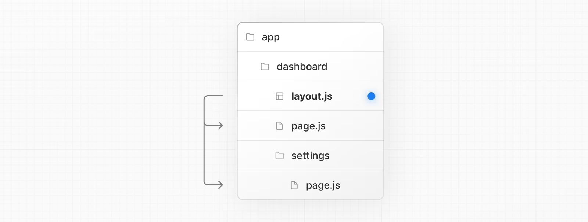
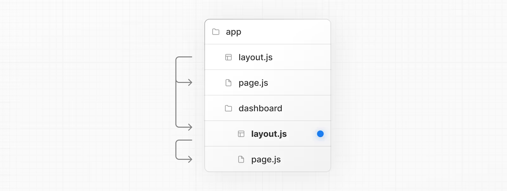
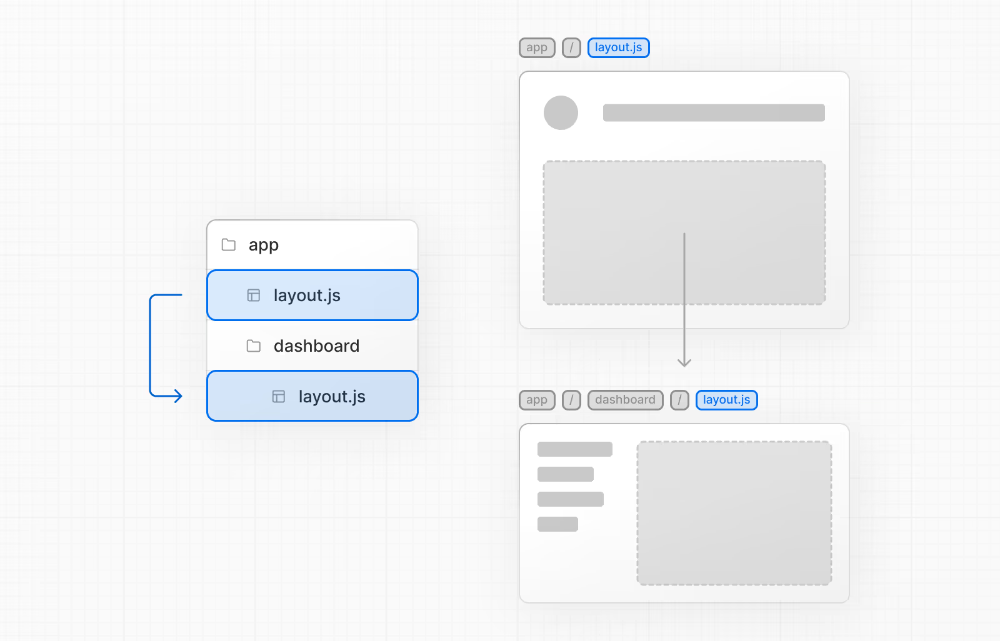

# 页面和布局

特殊文件 [`layout.js`](https://nextjs.org/docs/app/building-your-application/routing/pages-and-layouts#layouts)、[`page.js`](https://nextjs.org/docs/app/building-your-application/routing/pages-and-layouts#pages) 和 [`template.js`](https://nextjs.org/docs/app/building-your-application/routing/pages-and-layouts#templates) 允许我们为路由创建 UI。本页将介绍这些特殊文件以及使用方法。

## 1. 页面

页面是路由特有的 UI，我们可以默认从 `page.js` 文件导出组件来定义页面。例如，要创建索引页面 `index`，请在应用程序目录 `app` 中添加 `page.js` 文件：


```jsx linenums="1" title="app/page.tsx"
// `app/page.tsx` is the UI for the `/` URL
export default function Page() {
  return <h1>Hello, Home page!</h1>
}
```

然后，要创建更多页面，请创建一个文件夹并在其中添加 `page.js` 文件。例如，要为 `/dashboard` 路由创建页面，请创建一个名为 `dashboard` 的新文件夹，并在其中添加 `page.js` 文件：

```jsx linenums="1" title="app/dashboard/page.Jsx"
// `app/dashboard/page.tsx` is the UI for the `/dashboard` URL
export default function Page() {
  return <h1>Hello, Dashboard Page!</h1>
}
```

!!! note "补充"
    
    - `.js`、`.jsx` 或 `.tsx` 文件扩展名可用于页面
    - 页面始终是路由子树的叶子节点
    - 需要 `page.js` 文件才能公开访问路由段
    - 默认情况下，页面是服务端组件，但也可以设置为客户端组件
    - 页面可以获取数据，查看[数据获取](https://nextjs.org/docs/app/building-your-application/data-fetching)部分以获取更多信息

## 2. 布局

布局是在多个路由之间共享的 UI。在导航时，布局将保留状态以及交互性并**不会重新渲染**。当然，布局也可以进行嵌套。

您可以默认从 `layout.js` 文件导出 React 组件来定义布局。该组件应接受一个 `children` 属性，该属性将在渲染期间填充子布局（如果存在）或页面。

例如，`/dashboard` 和 `/dashboard/settings` 页面共享同一个布局：



```jsx linenums="1" title="app/dashboard/layout.jsx"
export default function DashboardLayout({ children }) { // will be a page or nested layout
  return (
    <section>
      {/* Include shared UI here e.g. a header or sidebar */}
      <nav></nav>
 
      {children}
    </section>
  )
}
```

### 2.1 根节点布局

根布局在应用程序目录 `app` 的顶层定义并适用于所有路由。此布局是必需的，并且必须包含 `html` 和 `body` 标记，允许您修改从服务器返回的初始 HTML。

```jsx linenums="1" title="app/layout.js"
export default function RootLayout({ children }) {
  return (
    <html lang="en">
      <body>
        {/* Layout UI */}
        <main>{children}</main>
      </body>
    </html>
  )
}
```

### 2.2 嵌套布局

默认情况下，文件夹层次结构中的布局是嵌套的，这意味着它们通过 `children` 属性包装子布局。我们可以通过在特定路由段（文件夹）内添加 `layout.js` 来嵌套布局。例如，要为 `/dashboard` 路由创建布局，请在 `dashboard` 文件夹中添加一个新的 `layout.js` 文件：



```jsx linenums="1" title="app/dashboard/layout.js"
export default function DashboardLayout({ children }) {
  return <section>{children}</section>
}
```

如果您要组合上面的两个布局，根布局 (`app/layout.js`) 将包装仪表板布局 (`app/dashboard/layout.js`)，后者会将路由段包装在 `app/dashboard/*` 内。

这两个布局将这样嵌套：



!!! note "补充"

    - `.js`、`.jsx` 或 `.tsx` 文件扩展名可用于布局。
    - 只有根布局可以包含 `<html>` 和 `<body>` 标签。
    - 当 `layout.js` 和 `page.js` 文件定义在同一个文件夹中时，布局将包裹页面。
    - 默认情况下，布局是服务端组件，但可以设置为客户端组件。
    - 布局可以获取数据。查看[数据获取](https://nextjs.org/docs/app/building-your-application/data-fetching)部分以获取更多信息。
    - **在父布局与其子布局之间传递数据是不可能的**。但是，您可以在一个路由中多次获取相同的数据，React 会自动删除请求的重复数据，而不会影响性能。
    - 布局无法通过路由段进行访问。要访问所有路由段，您可以在客户端组件中使用 `useSelectedLayoutSegment` 或 `useSelectedLayoutSegments`。
    - 在共享布局外，我们可以使用路由组选择特定路由段。
    - 您可以使用路由组来创建多个根布局，请参阅此处的[示例](https://nextjs.org/docs/app/building-your-application/routing/route-groups#creating-multiple-root-layouts)。
    - 从页面目录 `page` 迁移：根布局替换 `_app.js` 和 `_document.js` 文件，更多请查看[迁移指南](https://nextjs.org/docs/app/building-your-application/upgrading/app-router-migration#migrating-_documentjs-and-_appjs)。

## 3. 模板

模板与布局类似，它们包装每个子布局或页面。与跨路由持续存在并维护状态的布局不同，模板会为导航上的每个子级创建一个新实例。这意味着当用户在共享模板的路由之间导航时，将安装组件的新实例，重新创建 DOM 元素，不保留状态，并且重新同步效果。

在某些情况下，您可能需要这些特定行为，而模板将是比布局更合适的选择。例如：

- 依赖于 `useEffect`（例如记录页面视图）和 `useState`（例如每页反馈表）的功能。
- 更改默认框架行为。例如，布局内的 Suspense Boundaries 仅在第一次加载布局时显示回退，而不是在切换页面时显示回退。对于模板，后备显示在每个导航上。

可以通过从 `template.js` 文件导出默认的 React 组件来定义模板，该组件应该接受一个 `children`属性。


```jsx linenums="1" title="app/template.js"
export default function Template({ children }) {
  return <div>{children}</div>
}
```

在嵌套方面，`template.js` 在布局及其子布局之间呈现。这是一个简化的输出：

```jsx linenums="1"
<Layout>
  {/* Note that the template is given a unique key. */}
  <Template key={routeParam}>{children}</Template>
</Layout>
```

## 4. 元数据

在应用程序目录 `app` 中，您可以使用[元数据 API](https://nextjs.org/docs/app/building-your-application/optimizing/metadata) 修改 `<head>` HTML 元素，例如 `<title>` 和 `<meta>`。

可以通过在 `layout.js` 或 `page.js` 文件中导出[`metadata`](https://nextjs.org/docs/app/api-reference/functions/generate-metadata#the-metadata-object) 对象或 [`generateMetadata`](https://nextjs.org/docs/app/api-reference/functions/generate-metadata#generatemetadata-function) 函数来定义元数据。

```jsx linenums="1" title="app/page.js" 
export const metadata = {
  title: 'Next.js',
}
 
export default function Page() {
  return '...'
}
```

!!! info "补充"

    您不应该手动将 `<head>` 标签（例如 `<title>` 和 `<meta>`）添加到根布局。相反，您应该使用元数据 API，它会自动处理高级要求，例如流式传输和删除重复 `<head>` 元素。


你可以在 [API 参考](https://nextjs.org/docs/app/api-reference/functions/generate-metadata)中了解有关可用元数据选项的更多信息。
